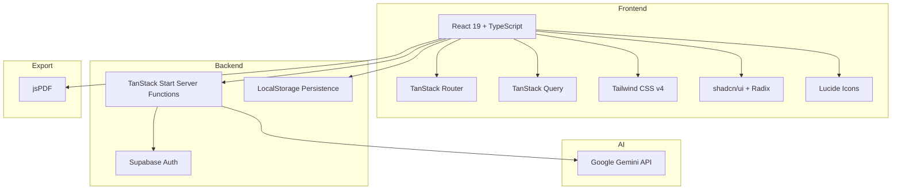

<div align="center">

# 🚀 FoundrIQ AI

### **Your AI Co-Founder. From Idea to Investor-Ready Startup.**

[](https://foundr-iq.vercel.app/)
[](https://react.dev/)
[](https://www.typescriptlang.org/)
[](https://tanstack.com/start/)
[](https://tailwindcss.com/)
[](https://supabase.com/)
[](https://deepmind.google/technologies/gemini/)

</div>

---

## 📖 Table of Contents

- [What is FoundrIQ?](#-what-is-foundriq)
- [Why FoundrIQ?](#-why-foundriq)
- [Core Features](#-core-features)
- [Live Experience](#-live-experience)
- [Tech Stack & Architecture](#-tech-stack--architecture)
- [Project Structure](#-project-structure)
- [Getting Started](#-getting-started)
- [Environment Variables](#-environment-variables)
- [Deployment](#-deployment)
- [User Flow](#-user-flow)
- [AI & PDF Engine](#-ai--pdf-engine)
- [Authentication & Security](#-authentication--security)
- [Theming](#-theming)
- [Performance & Stability](#-performance--stability)
- [Roadmap](#-roadmap)
- [Contributing](#-contributing)
- [License](#-license)

---

## ✨ What is FoundrIQ?

**FoundrIQ** is a production-ready AI Co-Founder platform that transforms raw startup ideas into complete, investor-ready business blueprints. Built for founders, students, and aspiring entrepreneurs, FoundrIQ combines cutting-edge generative AI with a polished, responsive SaaS interface to deliver market research, branding, business modeling, go-to-market strategy, and financial planning — all in one unified workspace.

Whether you're pitching to investors, preparing for a hackathon, or validating your next big idea, FoundrIQ gives you a structured, professional foundation in minutes, not weeks.

---

## 🎯 Why FoundrIQ?

Starting a company is hard. Research is scattered, templates are generic, and advice is often theoretical. FoundrIQ solves this by:

- **Automating deep research** with Google Gemini AI tailored to your market, budget, and experience.
- **Generating actionable documents** — not just text, but structured business blueprints.
- **Exporting investor-grade PDFs** with cover pages, SWOT analysis, financials, and more.
- **Persisting your work** so reports and history are always available, instantly.
- **Looking and feeling premium** with a modern dark/light UI, smooth animations, and mobile responsiveness.

---

## 🚀 Core Features

| Feature | Description |
|---------|-------------|
| **🧠 AI Startup Blueprint** | Generate a complete business plan from a short idea description, including problem, solution, market, competitors, revenue model, and roadmap. |
| **💬 AI Workspace Chat** | Continue the conversation with your AI co-founder to refine strategy, pricing, or positioning. |
| **📊 Reports Dashboard** | Auto-saved startup reports with AI-generated scores, industry tags, and one-click PDF export. |
| **🕘 History & Recovery** | Every generation is logged. Reopen any previous startup from history and restore the full report. |
| **📄 Professional PDF Export** | Download a polished, investor-ready PDF with cover page, executive summary, SWOT, financials, and page numbers. |
| **👤 Profile Management** | Edit full name, company, role, and upload a profile picture with instant preview and persistence. |
| **🔐 Secure Authentication** | Email/password auth with Supabase, email verification, password reset, and protected routes. |
| **🌗 Light & Dark Mode** | Choose your preferred theme. Preference persists across sessions with zero flash. |
| **📱 Fully Responsive** | Optimized for desktop, tablet, and mobile with a collapsible sidebar and adaptive layouts. |
| **⚡ Edge-Ready** | Built on TanStack Start for fast SSR/SSG and edge deployment on Vercel. |

---

## 🌐 Live Experience

**Production URL:** [https://foundr-iq.vercel.app/](https://foundr-iq.vercel.app/)

Try the full flow:

1. Sign up with email
2. Verify your email
3. Generate your first startup blueprint
4. Chat with the AI workspace
5. Download a PDF report
6. Manage your profile and settings

---

## 🛠 Tech Stack & Architecture



### Key Technologies

- **[TanStack Start](https://tanstack.com/start/)** — Full-stack React framework with type-safe routing and server functions.
- **[React 19](https://react.dev/)** — Latest React with concurrent features and improved SSR.
- **[TypeScript 5.8](https://www.typescriptlang.org/)** — End-to-end type safety.
- **[Tailwind CSS v4](https://tailwindcss.com/)** — Utility-first styling with CSS-native theming.
- **[shadcn/ui + Radix](https://ui.shadcn.com/)** — Accessible, composable UI primitives.
- **[Supabase](https://supabase.com/)** — Authentication, user management, and storage.
- **[Google Gemini](https://deepmind.google/technologies/gemini/)** — AI engine for startup blueprint generation.
- **[jsPDF](https://parall.ax/products/jspdf)** — Client-side PDF generation.
- **[Zod](https://zod.dev/)** — Schema validation for forms and server inputs.
- **[React Hook Form](https://react-hook-form.com/)** — Performant form handling.

---

## 📁 Project Structure

```
foundriq-ai/
├── public/                  # Static assets
├── src/
│   ├── components/          # Reusable UI components
│   │   ├── app/             # App-shell components (Sidebar, TopNav, etc.)
│   │   ├── brand/           # Logo and brand assets
│   │   └── ui/              # shadcn/ui primitives
│   ├── hooks/               # Custom React hooks (auth, profile, theme, mobile)
│   ├── integrations/        # Supabase client configuration
│   ├── lib/                 # Core business logic
│   │   ├── ai.functions.ts  # Server functions for AI generation
│   │   ├── ai.types.ts      # Shared AI types
│   │   ├── gemini.server.ts # Google Gemini integration
│   │   ├── startups.functions.ts # Local persistence layer
│   │   ├── report.ts        # PDF report generation
│   │   └── exports.ts       # Export utilities
│   ├── routes/              # TanStack file-based routes
│   │   ├── __root.tsx       # Root layout
│   │   ├── index.tsx        # Landing page
│   │   ├── auth.tsx         # Auth page
│   │   ├── app.tsx          # App shell
│   │   ├── app.create.tsx   # Startup creation
│   │   ├── app.workspace.tsx# AI workspace
│   │   ├── app.reports.tsx  # Reports list
│   │   ├── app.history.tsx  # History log
│   │   ├── app.settings.tsx # Profile settings
│   │   └── verification-success.tsx
│   ├── router.tsx           # Router configuration
│   ├── start.ts             # TanStack Start entry
│   └── styles.css           # Global styles & theme tokens
├── db/                      # Database setup scripts
├── .env.example             # Example environment variables
├── package.json
├── tsconfig.json
├── vite.config.ts
└── README.md
```

---

## 🚀 Getting Started

### Prerequisites

- **Node.js** `>= 20` (recommended via [nvm](https://github.com/nvm-sh/nvm))
- **Bun** or **npm** — this project uses Bun by default
- A **Supabase** project
- A **Google Gemini API Key**

### 1. Clone the Repository

```bash
git clone https://github.com/your-username/foundriq-ai.git
cd foundriq-ai
```

### 2. Install Dependencies

```bash
bun install
# or
npm install
```

### 3. Configure Environment Variables

```bash
cp .env.example .env
```

Fill in your credentials (see [Environment Variables](#-environment-variables)).

### 4. Start Development Server

```bash
bun dev
# or
npm run dev
```

The app will be available at [http://localhost:8080](http://localhost:8080).

---

## 🔐 Environment Variables

Create a `.env` file in the project root:

```env
# Supabase
VITE_SUPABASE_URL=https://your-project.supabase.co
VITE_SUPABASE_PUBLISHABLE_KEY=your-anon-public-key

# Google Gemini (server-side)
GEMINI_API_KEY=your-gemini-api-key
```

| Variable | Description | Required |
|----------|-------------|----------|
| `VITE_SUPABASE_URL` | Your Supabase project URL | ✅ Yes |
| `VITE_SUPABASE_PUBLISHABLE_KEY` | Your Supabase anon/public key | ✅ Yes |
| `GEMINI_API_KEY` | Google Gemini API key for AI generation | ✅ Yes |

> **Security Note:** `GEMINI_API_KEY` is only ever read inside server functions. It never reaches the browser.

---

## 🌐 Deployment

### Deploy to Vercel

1. Push your code to GitHub.
2. Import the repository in [Vercel](https://vercel.com/).
3. Add the environment variables from your `.env` file.
4. Deploy.

### Supabase Redirect URLs

For email verification and password reset to work across environments, add these redirect URLs in your Supabase project:

- `http://localhost:8080/verification-success`
- `http://localhost:8080/reset-password`
- `https://your-preview-url.vercel.app/verification-success`
- `https://foundr-iq.vercel.app/verification-success`
- `https://foundr-iq.vercel.app/reset-password`

> FoundrIQ dynamically builds redirect URLs from `window.location.origin`, so no hardcoded localhost values exist in the source code.

---

## 🧭 User Flow

```
Landing Page
    │
    ▼
Sign Up / Sign In (Supabase Auth)
    │
    ▼
Email Verification → 5s auto-redirect to Login
    │
    ▼
Dashboard / App Shell
    │
    ├──▶ Create Startup → AI Blueprint
    │
    ├──▶ AI Workspace → Chat & Refine
    │
    ├──▶ Reports → View & Download PDF
    │
    ├──▶ History → Restore Past Startups
    │
    └──▶ Settings → Edit Profile & Avatar
```

---

## 🤖 AI & PDF Engine

### AI Generation

FoundrIQ uses **Google Gemini** through type-safe TanStack server functions. The prompt is engineered to produce:

- Realistic market sizing and competitor names
- Tailored financial estimates based on budget and country
- Specific, non-generic business recommendations
- A deterministic AI score based on blueprint completeness

### JSON Repair

To handle occasional truncated AI responses, FoundrIQ includes a custom `repairJson()` utility that closes unterminated strings, arrays, and objects before parsing — ensuring stability even with imperfect network conditions.

### PDF Export

Reports are exported as professional PDFs using **jsPDF**, including:

- Cover page with startup name and tagline
- Executive summary
- Problem & solution
- Business & revenue models
- Target market & marketing strategy
- Competitor analysis
- SWOT analysis
- Financial overview
- AI startup score
- Final recommendations
- Date and page numbers

---

## 🔒 Authentication & Security

- **Supabase Auth** handles registration, login, email verification, and password reset.
- **Protected routes** are gated via authentication state.
- **Server functions** read secrets only inside handlers.
- **No sensitive keys** are exposed to the client.
- **Profile data** is stored locally and seeded from authenticated user metadata.

---

## 🌗 Theming

FoundrIQ supports both **Light** and **Dark** modes:

- Theme preference is stored in `localStorage` under `foundriq:theme`.
- A pre-hydration inline script applies the correct class before React renders, preventing theme flashes.
- Theme toggles are available on both the landing page and app navigation.

---

## ⚡ Performance & Stability

- **No duplicate requests** — TanStack Query caches and deduplicates server function calls.
- **No infinite loading states** — every async operation has timeout and error handling.
- **Friendly error messages** — all technical errors are replaced with human-readable copy.
- **Responsive UI** — adaptive layouts for mobile, tablet, and desktop.
- **Edge-ready build** — optimized for Vercel's serverless and edge runtime.

---

## 🗺 Roadmap

- [x] AI startup blueprint generation
- [x] AI workspace chat
- [x] Reports & history with local persistence
- [x] Professional PDF export
- [x] Authentication & email verification
- [x] Profile editing & avatar upload
- [x] Light / dark theme
- [ ] Team collaboration & shared workspaces
- [ ] Subscription billing (Stripe/Paddle)
- [ ] Real-time AI co-founder sessions
- [ ] Public shareable report links

---

## 🤝 Contributing

Contributions are welcome! Please follow these steps:

1. Fork the repository.
2. Create a feature branch: `git checkout -b feature/amazing-feature`.
3. Commit your changes: `git commit -m 'Add amazing feature'`.
4. Push to the branch: `git push origin feature/amazing-feature`.
5. Open a Pull Request.

Please ensure your code passes linting and type checks:

```bash
bun run lint
bun run build
```

---

## 📄 License

This project is licensed under the **MIT License**.

```
MIT License

Copyright (c) 2026 FoundrIQ

Permission is hereby granted, free of charge, to any person obtaining a copy
of this software and associated documentation files (the "Software"), to deal
in the Software without restriction, including without limitation the rights
to use, copy, modify, merge, publish, distribute, sublicense, and/or sell
copies of the Software, and to permit persons to whom the Software is
furnished to do so, subject to the following conditions:

The above copyright notice and this permission notice shall be included in all
copies or substantial portions of the Software.

THE SOFTWARE IS PROVIDED "AS IS", WITHOUT WARRANTY OF ANY KIND, EXPRESS OR
IMPLIED, INCLUDING BUT NOT LIMITED TO THE WARRANTIES OF MERCHANTABILITY,
FITNESS FOR A PARTICULAR PURPOSE AND NONINFRINGEMENT. IN NO EVENT SHALL THE
AUTHORS OR COPYRIGHT HOLDERS BE LIABLE FOR ANY CLAIM, DAMAGES OR OTHER
LIABILITY, WHETHER IN AN ACTION OF CONTRACT, TORT OR OTHERWISE, ARISING FROM,
OUT OF OR IN CONNECTION WITH THE SOFTWARE OR THE USE OR OTHER DEALINGS IN THE
SOFTWARE.
```

---

<div align="center">

### Built with passion for founders everywhere.

**[🚀 Launch FoundrIQ](https://foundr-iq.vercel.app/)**

</div>
