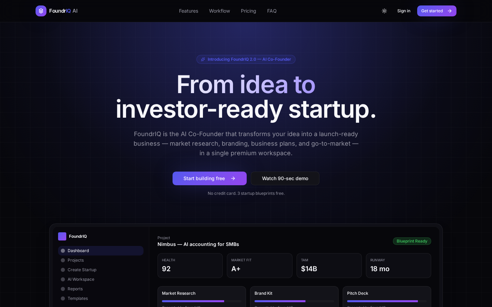
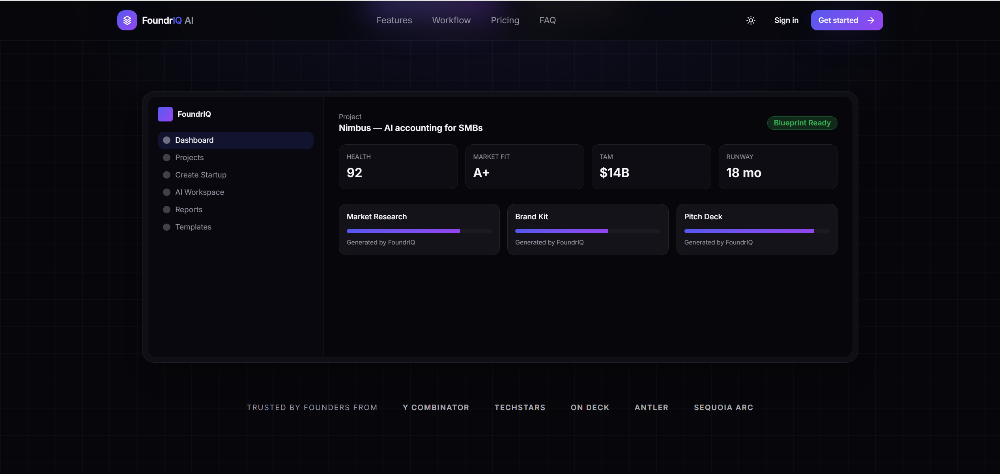
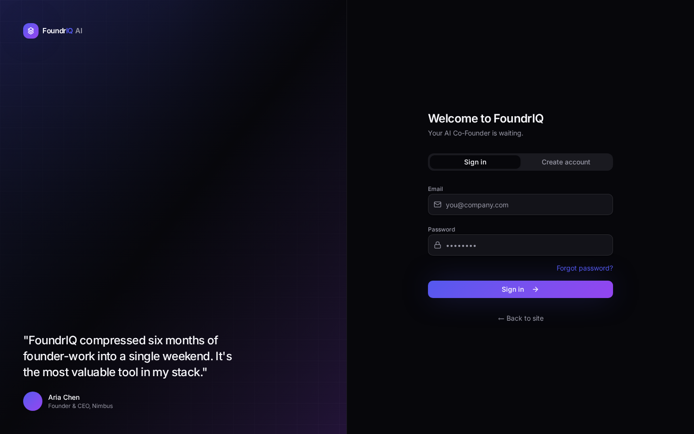
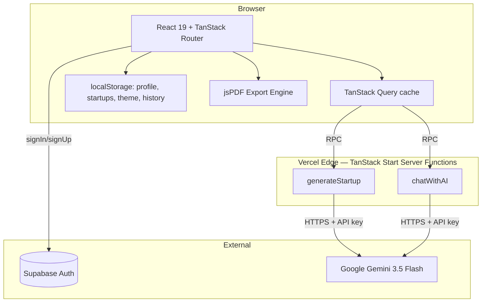

<div align="center">

# 🚀 FoundrIQ AI

### **Your AI Co-Founder. From Raw Idea to Investor-Ready Startup in Minutes.**

[](https://foundr-iq.vercel.app/)
[](https://react.dev/)
[](https://www.typescriptlang.org/)
[](https://tanstack.com/start/)
[](https://tailwindcss.com/)
[](https://supabase.com/)
[](https://deepmind.google/technologies/gemini/)

**👉 Live URL:** **[https://foundr-iq.vercel.app/](https://foundr-iq.vercel.app/)**

</div>

---

## 📖 Table of Contents

1. [What is FoundrIQ?](#-what-is-foundriq)
2. [The Problem & Who It's For](#-the-problem--who-its-for)
3. [Live Deployed URL](#-live-deployed-url)
4. [Features](#-features)
5. [The AI Feature — What It Does & How It's Prompted](#-the-ai-feature)
6. [Screenshots](#-screenshots)
7. [Tools, Services & AI Models](#-tools-services--ai-models)
8. [Architecture](#-architecture)
9. [Project Structure](#-project-structure)
10. [How to Run the Project](#-how-to-run-the-project)
11. [Environment Variables](#-environment-variables)
12. [Deployment](#-deployment)
13. [Roadmap](#-roadmap)
14. [License](#-license)

---

## ✨ What is FoundrIQ?

**FoundrIQ AI** is a production-grade SaaS platform that acts as your **AI Co-Founder**. You describe an idea in a sentence — FoundrIQ transforms it into a **complete, investor-ready startup blueprint** in under 60 seconds, complete with market research, competitor analysis, SWOT, business model, financials, branding, launch roadmap, and an exportable **investor-grade PDF report**.

It combines a fine-tuned prompting layer over **Google Gemini 3.5** with a polished, responsive SaaS interface (auth, workspace chat, reports, history, profile, PDF export, light/dark themes).

---

## 🎯 The Problem & Who It's For

**The Problem.** Every year, millions of aspiring founders, students, and hackathon teams sit on a great idea and stall — because building the first real artifact (a coherent business plan, market map, financial model, and pitch narrative) takes **weeks of scattered research**, expensive consultants, or generic templates that all read the same. Founders don't need more blank Notion docs — they need a **thinking partner** that turns a spark into a structured, defensible plan.

**FoundrIQ solves this** by acting as a senior venture strategist on demand. It grounds every output in your **budget, country, experience, and timeline** — so recommendations are realistic, not boilerplate — and it packages the result into a downloadable investor PDF you can pitch on day one.

**Who it's for:**

- 🎓 **Students & university teams** preparing capstone projects, business-school assignments, or startup competitions.
- 🧑‍💻 **Solo founders & indie hackers** validating ideas before quitting the day job.
- 🏆 **Hackathon teams** who need a full pitch deck's worth of thinking overnight.
- 💼 **Product managers & intrapreneurs** exploring new business lines internally.
- 🎨 **Non-technical creators** who have the vision but not the MBA vocabulary.

---

## 🌐 Live Deployed URL

### **🚀 [https://foundr-iq.vercel.app/](https://foundr-iq.vercel.app/)**

The site is live, public, and fully functional. Sign up with any email to generate your first blueprint end-to-end.

---

## 🚀 Features

Everything the app can actually do, today:

### 🧠 AI Startup Generation
- Turn a one-sentence idea into a **complete business blueprint** (25+ structured fields).
- Tailored to your **budget, country, target customers, experience, timeline, and unfair advantage**.
- Deterministic **AI Startup Score (60–98)** based on blueprint completeness.
- Robust **JSON-repair pipeline** — resilient to truncated AI responses.

### 💬 AI Workspace Chat
- Continue the conversation with your AI co-founder after generation.
- Context-aware: the AI always knows the current startup.
- Persistent conversation history within the session.

### 📊 Reports Dashboard
- Every generated startup auto-saves and appears newest-first.
- Each report shows **Name, Industry, Date, AI Score**, and a one-click **Download PDF**.
- Instant, no reload — powered by TanStack Query cache.

### 🕘 History & Instant Restore
- Full generation history log — click any past startup to **restore the complete blueprint**.
- Never lose a good idea.

### 📄 Investor-Grade PDF Export
- Professional multi-page PDF including:
  - Branded **Cover Page** with startup name & tagline
  - **Executive Summary**
  - **Problem & Solution**
  - **Business Model & Revenue Model**
  - **Target Market & Marketing Strategy**
  - **Competitor Analysis**
  - **SWOT Analysis**
  - **Financial Overview**
  - **AI Startup Score**
  - **Final Recommendations & Next Steps**
  - **Date & Page Numbers**

### 👤 Profile & Avatar Management
- Edit **full name, company, role**.
- Upload avatar (JPG / PNG / WEBP, up to 5MB) — auto-compressed and persisted.
- Avatar appears everywhere: sidebar, top nav, settings.

### 🔐 Secure Authentication
- Email + password auth via Supabase.
- **Professional email verification page** with 5-second auto-redirect.
- Password reset with dynamic redirect URLs (works in local dev, preview, and production — never localhost-hardcoded).
- Expired-link recovery with resend option.

### 🌗 Light & Dark Themes
- User-selectable, persisted in `localStorage`.
- Pre-hydration inline script — **zero theme flash** on page load.
- Toggle available on landing and inside the app.

### ⚡ Polish & Performance
- **No duplicate requests** (TanStack Query dedupe + cache).
- **No infinite loading** (every async path has timeout + fallback).
- **Friendly errors** everywhere — no stack traces or raw JSON leak to users.
- **Fully responsive** — desktop, tablet, mobile with collapsible sidebar.
- **SSR-safe** — hydration-mismatch-free (deterministic renders).
- **Edge-ready** — deployed on Vercel with TanStack Start server functions.

---

## 🤖 The AI Feature

FoundrIQ's core intelligence is a **prompt-engineered venture strategist** on top of **Google Gemini 3.5 Flash**, accessed exclusively server-side through TanStack Start server functions — the API key never touches the browser.

There are **two AI surfaces**:

### 1. Blueprint Generation

Given the founder's input (idea, problem, target customers, country, budget, experience, timeline, unfair advantage), the model returns a strictly-typed JSON blueprint with 25+ fields.

**System prompt (verbatim, lives in `src/lib/gemini.server.ts`):**

> *You are a senior venture strategist who has built and funded multiple startups. You produce concrete, investor-ready business blueprints grounded in current market reality.*
>
> *Rules: never use placeholder text, never repeat generic AI boilerplate, always name real competitors and realistic numbers with currency and timeframes, and tailor every section to the founder's country, budget, experience and timeline.*
>
> *Return ONLY minified JSON matching this exact shape: `{ startupName, tagline, elevatorPitch, problemStatement, solution, targetAudience, customerPersona, marketOpportunity, competitorAnalysis, uniqueSellingProposition, swotAnalysis:{strengths,weaknesses,opportunities,threats}, businessModel, revenueModel, pricingSuggestions, estimatedStartupCost, brandingStrategy, brandIdentity, logoConcept, colorPalette, marketingStrategy, launchRoadmap, financialEstimate, risks, growthOpportunities, investorPitchSummary, recommendations, nextSteps }`.*
>
> *Every string field must be 2–5 substantive sentences. Array fields need 3–5 specific items.*

**Generation config:** `temperature: 1.0`, `topP: 0.95`, `maxOutputTokens: 32768`, `responseMimeType: application/json`, plus a per-request uniqueness seed so the same idea produces fresh perspectives on retry.

**Reliability guarantees:**
- 3-attempt retry with exponential backoff on 429/5xx.
- 45s timeout with `AbortController`.
- Custom `repairJson()` closes unterminated strings, arrays, and objects if Gemini truncates — parsing survives imperfect responses.
- Structured error mapping → human-friendly toasts (never leaks raw errors).

### 2. Workspace Chat Co-Founder

An always-on advisor that continues the conversation with full startup context.

**System prompt (verbatim):**

> *You are FoundrIQ's startup consultant: a professional advisor with operator experience in product, go-to-market, fundraising and unit economics. Always answer in the context of the founder's current startup and the ongoing conversation. Be specific and structured: short intro line, then markdown headings or numbered steps, then a concrete next action. Use real numbers, benchmarks and named examples. Never give vague, generic or filler answers, and never invent facts about the founder that were not provided.*

The generated blueprint JSON is injected into the system prompt as authoritative context, and the last 20 turns of chat history are passed as the conversation trail. Temperature `0.7` keeps advice grounded.

---

## 📸 Screenshots

### 1. Landing Page — Hero & Value Proposition


### 2. Features Section — What FoundrIQ Delivers


### 3. Authentication — Sign Up & Sign In


### 4. Dashboard


> All screenshots captured from the live production deployment at [foundr-iq.vercel.app](https://foundr-iq.vercel.app/).

---

## 🛠 Tools, Services & AI Models

### 🤖 AI Model
| Model | Provider | Purpose |
|-------|----------|---------|
| **Gemini 3.5 Flash** | Google DeepMind | Blueprint generation + workspace chat (JSON mode, 32K max output tokens) |

### 🧩 Frameworks & Libraries
| Tool | Version | Role |
|------|---------|------|
| **[TanStack Start](https://tanstack.com/start/)** | v1 | Full-stack React framework (SSR, server functions, file-based routing) |
| **[TanStack Router](https://tanstack.com/router)** | v1 | Type-safe routing |
| **[TanStack Query](https://tanstack.com/query)** | v5 | Data fetching, caching, request deduplication |
| **[React](https://react.dev/)** | 19 | UI framework |
| **[TypeScript](https://www.typescriptlang.org/)** | 5.8 | End-to-end type safety |
| **[Vite](https://vitejs.dev/)** | 7 | Build tool |
| **[Tailwind CSS](https://tailwindcss.com/)** | v4 | Utility-first styling with CSS-native theming |
| **[shadcn/ui](https://ui.shadcn.com/) + [Radix UI](https://www.radix-ui.com/)** | latest | Accessible component primitives |
| **[Lucide Icons](https://lucide.dev/)** | latest | Icon system |
| **[React Hook Form](https://react-hook-form.com/)** | v7 | Form state management |
| **[Zod](https://zod.dev/)** | v3 | Schema validation |
| **[jsPDF](https://parall.ax/products/jspdf)** | latest | Client-side PDF generation |
| **[Sonner](https://sonner.emilkowal.ski/)** | latest | Toast notifications |

### ☁️ Services
| Service | Role |
|---------|------|
| **[Supabase](https://supabase.com/)** | Auth (email/password, email verification, password reset) |
| **[Vercel](https://vercel.com/)** | Hosting, edge runtime, CI/CD |
| **[Google AI Studio](https://aistudio.google.com/)** | Gemini API key provisioning |
| **[GitHub](https://github.com/)** | Source control |

### 🎨 Built With
- **[Lovable](https://lovable.dev/)** — AI-native development environment used to design, iterate, and ship FoundrIQ.

---

## 🏗 Architecture



**Design decisions:**
- **Local-first persistence** for reports/history/profile (localStorage) → zero backend cost, instant reads, offline-friendly.
- **Server-only Gemini calls** → API key never leaks to the client.
- **Dynamic redirect URLs** built from `window.location.origin` → works in dev, preview, and production without hardcoding.

---

## 📁 Project Structure

```
foundriq-ai/
├── docs/screenshots/         # README screenshots
├── src/
│   ├── components/           # UI components (app shell, brand, shadcn primitives)
│   ├── hooks/                # use-auth, use-profile, use-theme, use-mobile
│   ├── integrations/         # Supabase client
│   ├── lib/
│   │   ├── ai.functions.ts   # Server functions (generateStartup, chatWithAI)
│   │   ├── ai.types.ts       # Shared blueprint types
│   │   ├── gemini.server.ts  # Gemini prompts + JSON repair
│   │   ├── startups.functions.ts # LocalStorage persistence
│   │   ├── report.ts         # jsPDF investor-grade export
│   │   └── exports.ts
│   ├── routes/               # File-based routing (TanStack Start)
│   │   ├── __root.tsx        # Pre-hydration theme script
│   │   ├── index.tsx         # Landing + 90s demo modal
│   │   ├── auth.tsx          # Sign in / sign up
│   │   ├── verification-success.tsx
│   │   ├── reset-password.tsx
│   │   ├── app.tsx           # Protected app shell
│   │   ├── app.create.tsx    # Blueprint generator
│   │   ├── app.workspace.tsx # AI chat
│   │   ├── app.reports.tsx   # Reports list
│   │   ├── app.history.tsx   # History log
│   │   └── app.settings.tsx  # Profile + avatar
│   ├── router.tsx
│   ├── start.ts
│   └── styles.css            # Light + dark theme tokens
├── .env.example
├── package.json
└── README.md
```

---

## 🏃 How to Run the Project

### Prerequisites
- **Node.js ≥ 20**
- **Bun** (recommended) or npm
- A **Supabase** project (free tier is fine)
- A **Google Gemini API key** ([get one](https://aistudio.google.com/app/apikey))

### 1. Clone
```bash
git clone https://github.com/your-username/foundriq-ai.git
cd foundriq-ai
```

### 2. Install
```bash
bun install
# or
npm install
```

### 3. Configure environment
```bash
cp .env.example .env
```
Fill in the values (see [Environment Variables](#-environment-variables)).

### 4. Run dev server
```bash
bun dev
# or
npm run dev
```
Open **[http://localhost:8080](http://localhost:8080)**.

### 5. Build for production
```bash
bun run build
bun run start
```

### 6. Quality checks
```bash
bun run lint
bun run build   # type-checks + builds
```

---

## 🔐 Environment Variables

```env
# Supabase (public — safe on the client)
VITE_SUPABASE_URL=https://your-project.supabase.co
VITE_SUPABASE_PUBLISHABLE_KEY=your-anon-public-key

# Google Gemini (server-only — never exposed to the browser)
GEMINI_API_KEY=your-gemini-api-key
```

| Variable | Required | Scope |
|----------|----------|-------|
| `VITE_SUPABASE_URL` | ✅ | client |
| `VITE_SUPABASE_PUBLISHABLE_KEY` | ✅ | client |
| `GEMINI_API_KEY` | ✅ | **server only** |

---

## 🌐 Deployment

Deployed on **Vercel** at **[foundr-iq.vercel.app](https://foundr-iq.vercel.app/)**.

### Deploy your own
1. Push to GitHub.
2. Import into Vercel.
3. Set the environment variables above in Vercel → Settings → Environment Variables.
4. Deploy — Vercel auto-detects TanStack Start.

### Supabase redirect URLs
Add these to your Supabase project under **Auth → URL Configuration → Redirect URLs**:
- `http://localhost:8080/verification-success`
- `http://localhost:8080/reset-password`
- `https://<your-deployment>.vercel.app/verification-success`
- `https://<your-deployment>.vercel.app/reset-password`

Redirects are built dynamically from `window.location.origin` — no hardcoded values anywhere in the codebase.

---

## 🗺 Roadmap

- [x] AI startup blueprint generation
- [x] AI workspace chat with persistent context
- [x] Local-first Reports & History
- [x] Investor-grade PDF export
- [x] Auth, email verification, password reset
- [x] Profile editing & avatar upload
- [x] Light / dark themes
- [x] Live production deployment
- [ ] Team collaboration & shared workspaces
- [ ] Stripe/Paddle subscription billing
- [ ] Public shareable report links
- [ ] Real-time collaborative co-founder sessions

---

## 📄 License

This project is licensed under the **MIT License**.

```
MIT License

Copyright (c) 2026 FoundrIQ

Permission is hereby granted, free of charge, to any person obtaining a copy
of this software and associated documentation files (the "Software"), to deal
in the Software without restriction, including without limitation the rights
to use, copy, modify, merge, publish, distribute, sublicense, and/or sell
copies of the Software, and to permit persons to whom the Software is
furnished to do so, subject to the following conditions:

The above copyright notice and this permission notice shall be included in all
copies or substantial portions of the Software.

THE SOFTWARE IS PROVIDED "AS IS", WITHOUT WARRANTY OF ANY KIND, EXPRESS OR
IMPLIED, INCLUDING BUT NOT LIMITED TO THE WARRANTIES OF MERCHANTABILITY,
FITNESS FOR A PARTICULAR PURPOSE AND NONINFRINGEMENT. IN NO EVENT SHALL THE
AUTHORS OR COPYRIGHT HOLDERS BE LIABLE FOR ANY CLAIM, DAMAGES OR OTHER
LIABILITY, WHETHER IN AN ACTION OF CONTRACT, TORT OR OTHERWISE, ARISING FROM,
OUT OF OR IN CONNECTION WITH THE SOFTWARE OR THE USE OR OTHER DEALINGS IN THE
SOFTWARE.

```

<div align="center">

### Built with passion for founders everywhere.

**[🚀 Try FoundrIQ Live](https://foundr-iq.vercel.app/)**

</div>
